 

 

<!--  -->

---

## 👋 About Me

I’m a **Senior Full Stack Engineer** with 8+ years of experience building scalable SaaS platforms, AI-enabled workflows, distributed APIs, and cloud-native applications for product-driven engineering teams.

My **primary stack** is centered around **React, Next.js, TypeScript, Node.js, Python, and FastAPI** for modern SaaS and AI product development. I also work with **C#, ASP.NET Core, .NET, and Azure** as a secondary stack for enterprise backend systems, business platforms, and cloud-based applications.

---

## 🚀 Engineering Focus

<table>
<tr>
<td width="50%" valign="top">

### Primary Stack

- React / Next.js product interfaces
- TypeScript full-stack applications
- Node.js / NestJS backend systems
- Python / FastAPI services
- SaaS platform architecture
- AI product integrations

</td>
<td width="50%" valign="top">

### Secondary Stack

- C# / ASP.NET Core APIs
- .NET enterprise applications
- Azure cloud services
- SQL Server integrations
- RBAC and workflow systems
- Business operations platforms

</td>
</tr>
</table>

---

## 🧰 Tech Stack

### Main Stack

### Secondary / Enterprise Stack

---

## 🏗️ Featured Work

<table>
<tr>
<td width="50%" valign="top">

### AI Customer Engagement Platform

`React • Next.js • TypeScript • Node.js • OpenAI • PostgreSQL`

Built AI-assisted customer engagement workflows for SaaS platforms, improving onboarding automation, semantic search, and support operations across enterprise product environments.

</td>
<td width="50%" valign="top">

### Multi-Tenant SaaS Platform

`Next.js • NestJS • PostgreSQL • Redis • AWS`

Designed scalable multi-tenant SaaS architecture with authentication, RBAC, organization management, audit logging, API integrations, and production-ready deployment workflows.

</td>
</tr>
<tr>
<td width="50%" valign="top">

### AI Invoice Processing Automation

`Python • FastAPI • OCR • PostgreSQL • AWS`

Developed AI-assisted invoice processing and workflow automation systems using OCR pipelines, backend APIs, and cloud-based processing flows to reduce manual financial operations.

</td>
<td width="50%" valign="top">

### Enterprise Operations Platform

`C# • ASP.NET Core • SQL Server • Azure • Redis`

Built enterprise workflow modules, role-based access control, reporting APIs, and operational dashboards for business teams requiring secure and maintainable backend systems.

</td>
</tr>
</table>

---

## ⚙️ What I Build

| SaaS Platforms | AI Workflows | Cloud Systems | Enterprise Apps |
|---|---|---|---|
| Multi-tenant architecture | LLM integrations | AWS / Azure infrastructure | C# / .NET APIs |
| Subscription workflows | RAG pipelines | Docker / Kubernetes | RBAC systems |
| Product dashboards | Semantic search | CI/CD automation | Reporting tools |
| API ecosystems | Automation agents | Observability | SQL-backed services |

---

## 📊 GitHub Activity

 

 

---

## 🤝 Connect

